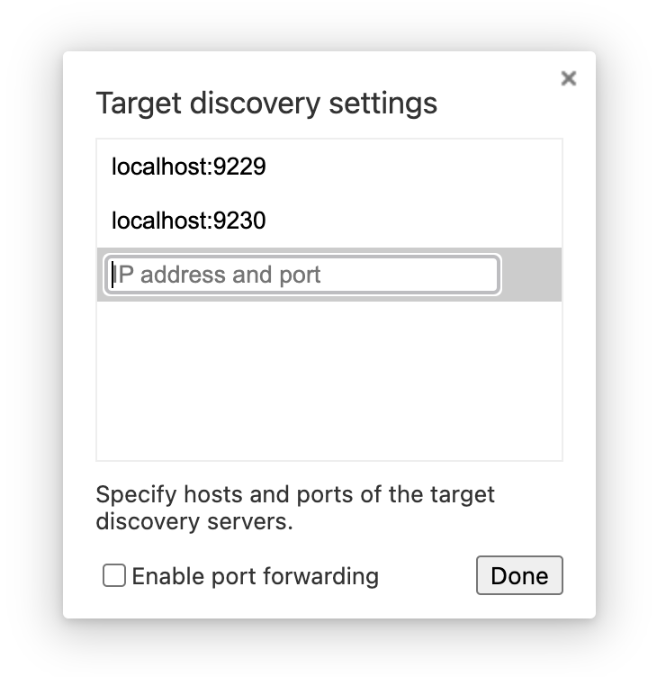
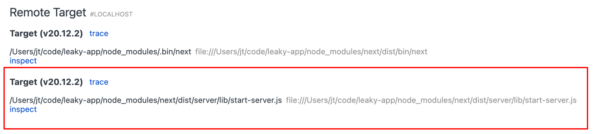

# LeakyGram

Sample SPA app for memory leak debugging workshop

### Getting started

```
$ npm install
$ npm run dev
```

### Debugging

In Chrome navigate to `chrome://inspect`

If no debugging targets are available. Add them:



For this app the correct target is this one:



**The application's debugger url is the one running on port 9230**

Attach to it and go to the *Memory* tab.
